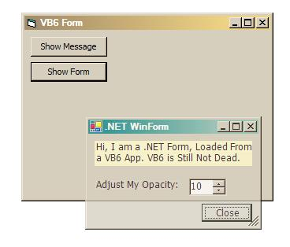



## Use \.NET Class Libraries in VB6 Apps

### Description

(it an re-upload of my old article, its was accedentally removed)

You can use COM Components in .NET Apps, but have you ever wished for the other way, Use of .NET Classes you have written in VB6 a apps. Yes, this is possible, just read this tutorial.
 
### More Info
 

             |
---                |---
**Submitted On**   |2005-02-02 00:23:30
**By**             |[Abhishek\.NET](https://github.com/Planet-Source-Code/PSCIndex/blob/master/ByAuthor/abhishek-net.md)
**Level**          |Intermediate
**User Rating**    |4.7 (14 globes from 3 users)
**Compatibility**  |VB 4\.0 \(32\-bit\), VB 5\.0, VB 6\.0
**Category**       |[OLE/ COM/ DCOM/ Active\-X](https://github.com/Planet-Source-Code/PSCIndex/blob/master/ByCategory/ole-com-dcom-active-x__1-29.md)
**World**          |[Visual Basic](https://github.com/Planet-Source-Code/PSCIndex/blob/master/ByWorld/visual-basic.md)
**Archive File**   |[Use\_\_NET\_C1976792282006\.zip](https://github.com/Planet-Source-Code/abhishek-net-use-net-class-libraries-in-vb6-apps__1-64473/archive/master.zip)

